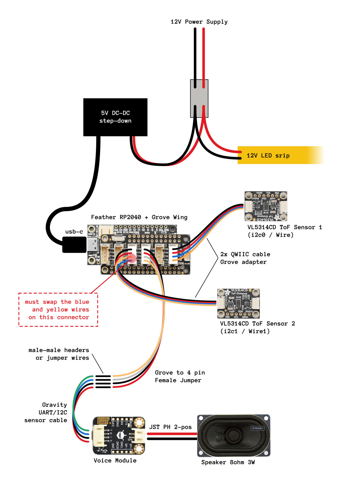
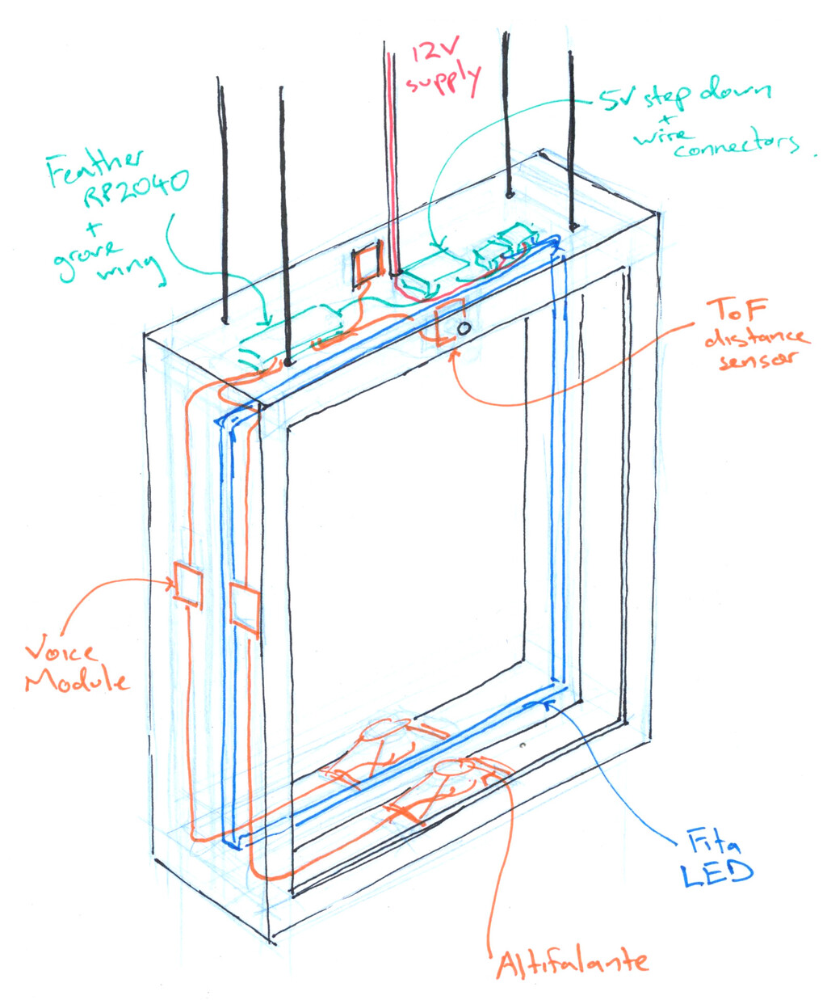
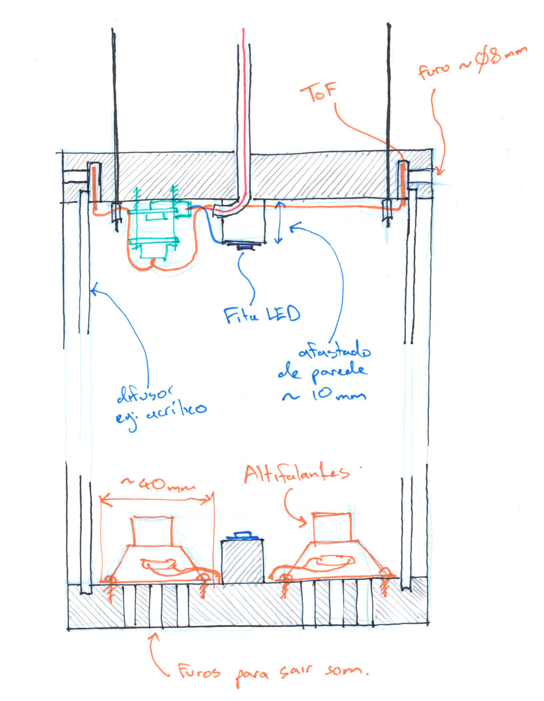
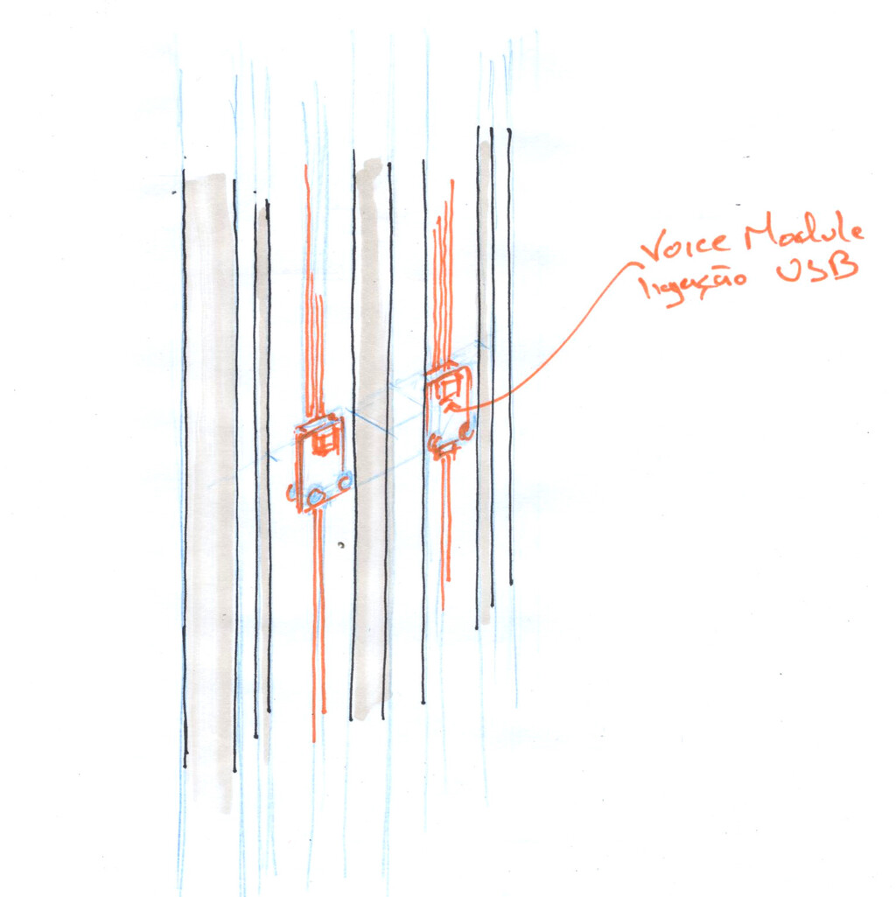

# Som Cartas

## BOM

| qty | | |
| --- | --- | --- |
| 1 | 12V Power Supply |  |
| 1 | double in-line wire connector |  |
| - | 12V LED strip |  |
| 1 | 5V step down w. usb-c | [aliexpress](https://pt.aliexpress.com/item/32782801858.html) |
| 1 | [adafruit Feather RP2040](https://www.adafruit.com/product/4884) | [digikey](https://www.digikey.pt/pt/products/detail/adafruit-industries-llc/4884/14000603) |
| 1 | [adafruit grove feather wing](https://www.adafruit.com/product/5862) | [digikey](https://www.digikey.pt/pt/products/detail/adafruit-industries-llc/5862/22596385) |
| 2 | [adafruit VL53L4CD tof 1-1300mm](https://www.adafruit.com/product/5396) | [digikey](https://www.digikey.pt/pt/products/detail/adafruit-industries-llc/5396/16129669) |
| 1 | sparkfun grove to quiic cable 100mm | [digikey](https://www.digikey.pt/pt/products/detail/sparkfun-electronics/PRT-15109/9770721) |
| 1 | [dfrobot voice module](https://www.dfrobot.com/product-1741.html) | [digikey](https://www.digikey.pt/pt/products/detail/dfrobot/DFR0534/9490120) |
| 1 | [grove to female jumpers](https://www.seeedstudio.com/Grove-4-pin-Female-Jumper-to-Grove-4-pin-Conversion-Cable-5-PCs-per-PAck.html) | [digikey](https://www.digikey.pt/pt/products/detail/seeed-technology-co-ltd/110990028/5482559) |
| 1 | [adafruit STEMMA to female jumpers](https://www.adafruit.com/product/3950) | [digikey](https://www.digikey.pt/en/products/detail/adafruit-industries-llc/3950/9745249) |
| 4 | male-male header pins or jumper wires | |
| 1 | speaker 8ohm 3W | [digikey](https://www.digikey.pt/pt/products/detail/db-unlimited/SC700208-1/9990575) |
| 1 | speaker connector cable - JST PH 2mm 2pin | [aliexpress](https://pt.aliexpress.com/item/1005007079265201.html) |

## Wiring Diagram

## Concept Sketches

